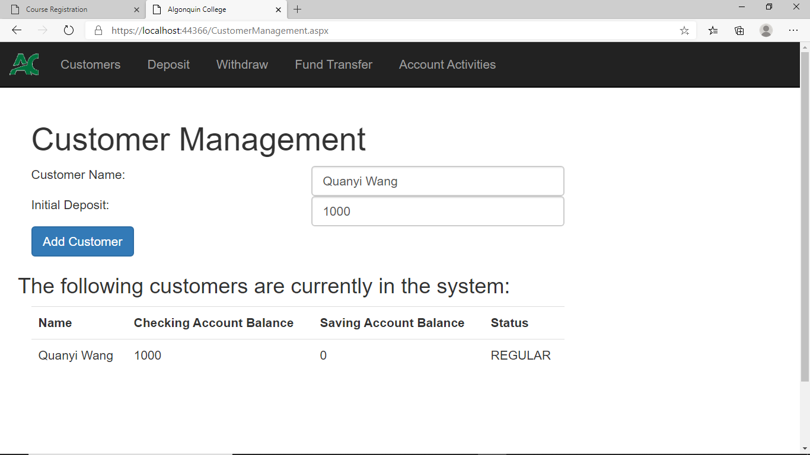
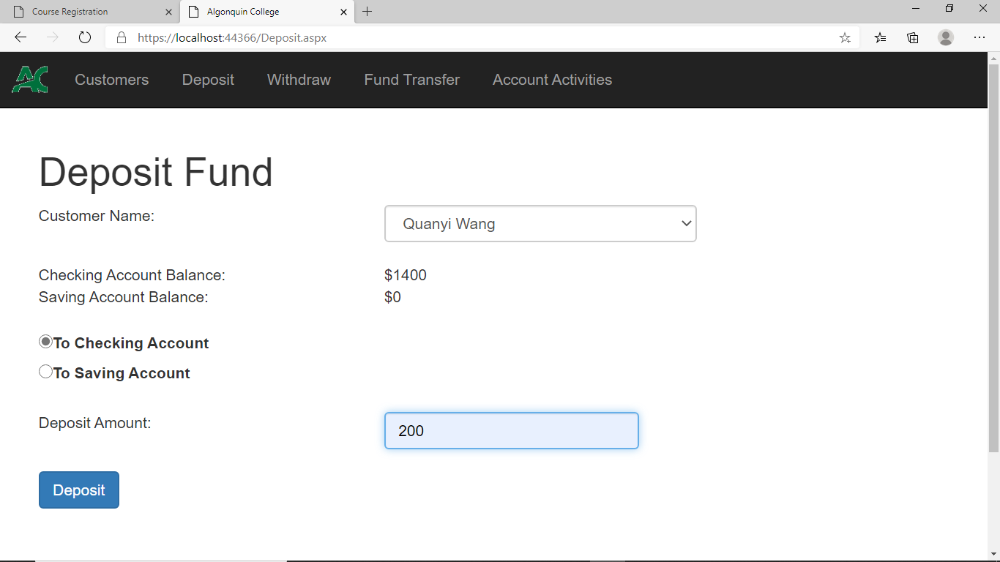
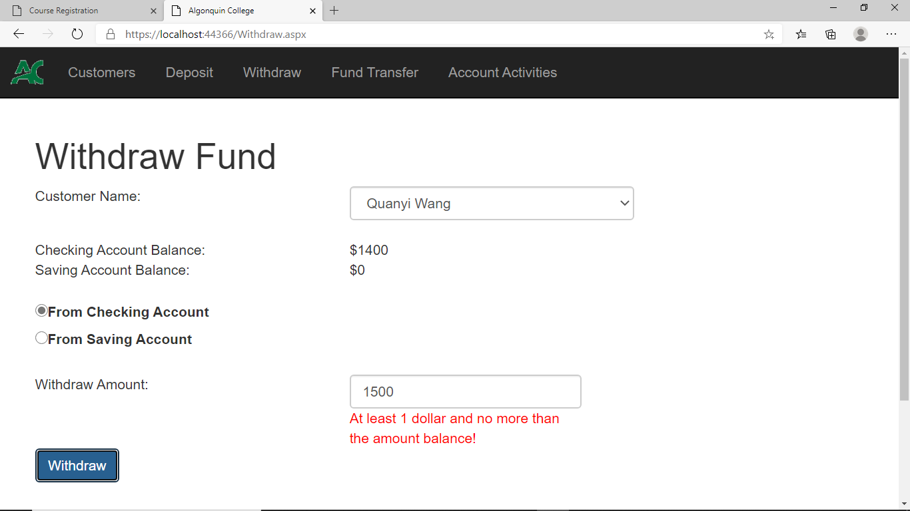
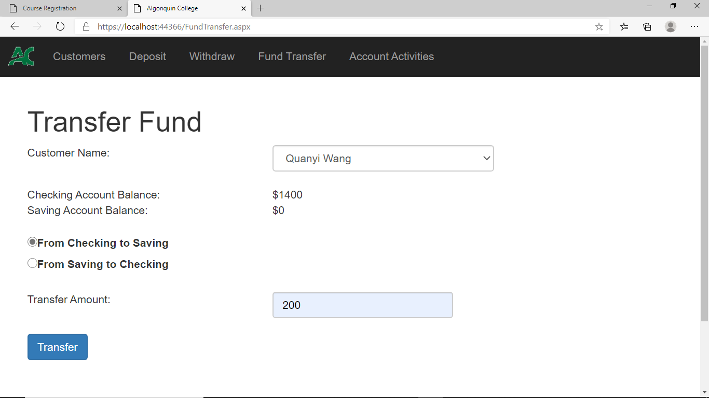
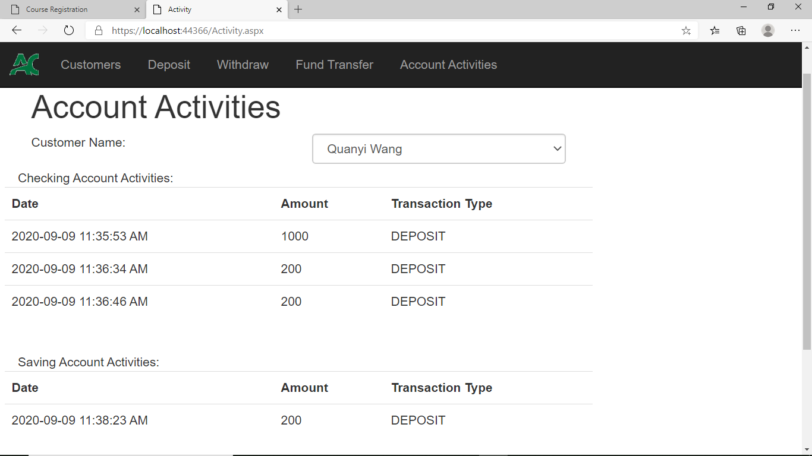

# Online Banking System C#

Create a new Web Form ASP.NET Web Application (.NET Framework) in Visual Studio 2019, and introduce Customers, Deposits, Withdraw, Fund Transfer, Account Activities to the Form according to certain conditions. 

Objectives
1. Use ASP.NET Validation Controls
2. Use ASP.NET Master Page
3. Understand and use inheritance,polymorphism in OOP

# Images of Finished Project

